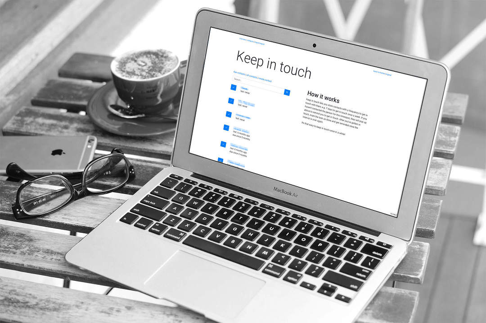
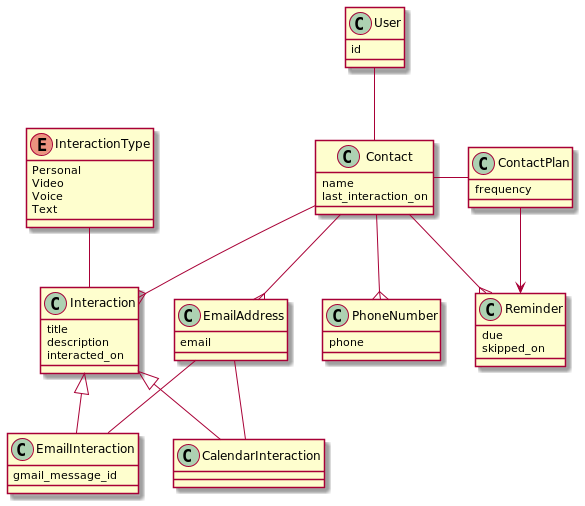

# Keep in touch | my personal CRM
This is a personal CRM I built for myself.
It reminds me to get in touch with my contacts from time to time.
It's a super-small project built with Django, fully dockerized, running locally.
So you can host it wherever you like, hack it however you like, and query the DB with SQL to find out whatever you like.

## How it works
Keep in touch lets you store contacts with a frequency to get in touch with them, e.g. 7 days to get in touch once a week. 
* If you haven't contacted the person for this timespan, they will be marked as due to remind you to get in touch. 
* After you've gotten in touch, create a touchpoint and get reminded once the interval is over again.

It's that easy to keep in touch once in a while and has helped me to say in touch with a lot of my contacts.

## Features
* show due contacts to see who to get in touch with
* create touchpoints to remember interactions
* list all contacts with last and next interaction
* search for contacts to save specific interactions
* create contacts with name, frequency, description, and options to get in touch (email, twitter, linkedin, phone)
* import cards from trello (which I used before)

## Installation
The setup with [docker-compose](https://docs.docker.com/compose/) to install and run everything should take less than a minute.

1. run the container (in the background): `docker-compose up -d`
2. create a database with `docker-compose exec web ./manage.py migrate` 
3. create a user for yourself: `docker-compose exec web ./manage.py createsuperuser`
4. open a browser at `localhost:8008` and sign in with the superuser credentials

The directory is mounted into the container, the database can be found at `./db.sqlite3`, e.g. to edit or backup.

### Use the Google integration
Enable Google OAuth to use automated contact, calendar, and interaction discovery:

- see https://django-allauth.readthedocs.io/en/latest/providers.html#google
- in admin, change site to localhost
- add social app: http://localhost:8008/admin/socialaccount/socialapp/add/
- connect your account at http://localhost:8008/accounts/social/connections/

## ToDo
* Improve import by editing afterwards
* Improve import by extracting and using emails
* Merging contacts
* add type of touchpoint and note functionality

## Data Model

## Related projects
* There's a fully featured, open source personal crm called [monica](https://github.com/monicahq/monica) (PHP, Laravel)
* If you're looking for more features like a diary, notes, relationships, or properties, there's [jens-ox/prm](https://github.com/jens-ox/prm)
